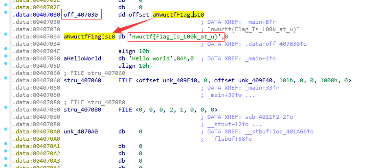

- [**re1**](#re1)
- [**pyc**](#pyc)
- [**Let's learn C**](#lets-learn-c)
- [**crackme**](#crackme)
- [**nwu**](#nwu)

# **re1**


看结果是hello world,目测主函数只是打印，答案就藏在里面

IDA打开，找到main函数，先aHelloWorld入栈，然后call子函数，然后。。。

反正我也不是每句都认识，把子函数，或者数据地址都点点看

刚开始跳转sub_4011F2发现太乱了，就回来点下一个off_407030，马上找到答案，其他的就不看了。~反正也看不懂~


# **pyc**
题目是一个pyc文件，首先对其进行反编译

发现很多0和o，本地创建后，以比较常见的名称替换恢复后，代码如下
```python
#!/usr/bin/env python
# encoding: utf-8

def bar1():
    
    try:
        bar2 = int(raw_input('please enter your key:'))
    except Exception:
        None
        None
        None
        bar2 = 1

    return bar2


def bar3(bar4):
    bar5 = 0xD8EA21CE54EAA6F16593CC9D3F9B6AEEB2124692BAD8A1B3A12953B394C9FCA82538529753D0CCA7FBCB90D9708CAFB080852772D1907A62418F27EFE7FB27EFL
    bar6 = 0x21FF2254681BD592E13F732612B964DA42A68735FF7D96600E3104CCD366FFA3056FE0A803A5AE51E215A9CD544C29116EF912E7B516781B0A781630BABF68B0L
	# pow函数是计算x的y次方，如果z在存在，则再对结果进行取模，其结果等效于pow(x,y) %z
    if pow(2, bar4, bar5) == bar6:
        print 'nwuctf{key}' 
    else:
        print 'sorry, please try again!'

while True:
    bar7 = bar1()
    bar3(bar7)

```
就算运行一下也还是因为太长出错

剩下的就一目了然了嘛~不会了~

# **Let's learn C**

代码复制，格式化后如下
```c
#include <stdio.h>
#include <string.h>
int main()
{
    FILE *txt;
    char rflag[30];
    char *tflag = "nxwfxf|EfGCDEfgCdEFgCDeF\x81";
    int i, j;
    txt = fopen("flag.txt", "r");
    fgets(rflag, 26, txt);
    for (i = 0; i < 5; i++)
        for (j = 0; j < 5; j++)
            rflag[i * 5 + j] = rflag[i * 5 + j] + j;//每位加0到4进行偏移
    if (strcmp(tflag, rflag) == 0)//比较
        puts("good!");
    else
        puts("error");
    fclose(txt);
    return 0;
}
```
可以看出代码是从flag.txt中读取答案，然后对每一位进行偏移0到4的偏移量（j的值），也就是说把tflag给减去相应的偏移量（x81即0x81-4=0x7D对应的ASII码，即}）

首先想着直接在写一份代码，进行循环减偏移量
```c
#include <stdio.h>
#include <string.h>
int main()
{

    char *tflag = "nxwfxf|EfGCDEfgCdEFgCDeF\x81";
    int i, j;

    for (i = 0; i < 5; i++)
        for (j = 0; j < 5; j++)
            tflag[i * 5 + j] = tflag[i * 5 + j] - j;
    printf("%s", tflag);
    return 0;
}
```
似乎没有结果，好像是有错，不太知道怎么改，有会的老铁麻烦指点一下

那就暂时只好手动一个个的恢复：`nwuctf{CcCCCCccCcCCcCCcC}`，手写了几个才发现，妈的全是c，大小写对应上即可。

# **crackme**

题目一直说是VB6写的，但是不懂VB，查查也无从下手，IDA扔一下也没看出什么来，先跳过吧

# **nwu**
提示先扔到IDA里看一下，基本上也看不出来什么

只能看出来栈区大小是34字节