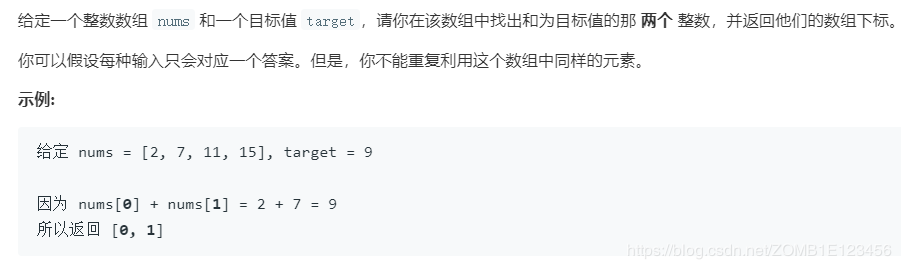

- [题目描述](#%e9%a2%98%e7%9b%ae%e6%8f%8f%e8%bf%b0)
- [解法1、切片后查找](#%e8%a7%a3%e6%b3%951%e5%88%87%e7%89%87%e5%90%8e%e6%9f%a5%e6%89%be)
- [解法2、hash字典](#%e8%a7%a3%e6%b3%952hash%e5%ad%97%e5%85%b8)
- [解法3、同2](#%e8%a7%a3%e6%b3%953%e5%90%8c2)
- [出处](#%e5%87%ba%e5%a4%84)

# 题目描述


# 解法1、切片后查找

```python
class Solution:
    def twoSum(self, nums: List[int], target: int) -> List[int]:
        for i in nums:
            j = target - i
            start_index = nums.index(i)
            next_index = start_index + 1
            temp_nums = nums[next_index:]
            if j in temp_nums:
                return [nums.index(i), next_index + temp_nums.index(j)]
```
注意返回值index的转换
# 解法2、hash字典

```python
class Solution:
    def twoSum(self, nums: List[int], target: int) -> List[int]:
        dict = {}
        for i in range(len(nums)):
            if target - nums[i] not in dict:
                dict[nums[i]] = i
            else:
                return [dict[target-nums[i]], i]
```

# 解法3、同2

```python
class Solution:
    def twoSum(self, nums: List[int], target: int) -> List[int]:
        dict = {}
        for i, num in enumerate(nums):
            if target - num in dict:
                return [dict[target-num], i]
            dict[num] = i
```
借助枚举函数，方法同2

# 出处
1、2、https://www.bilibili.com/video/av45727557