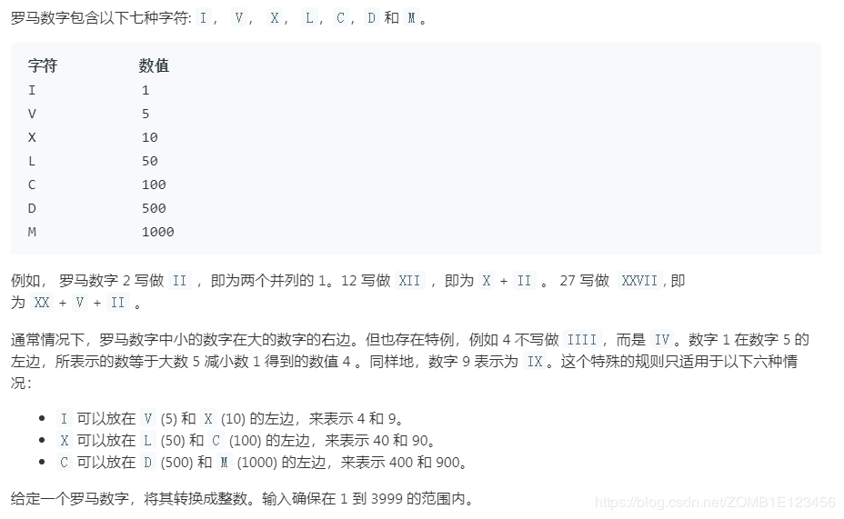
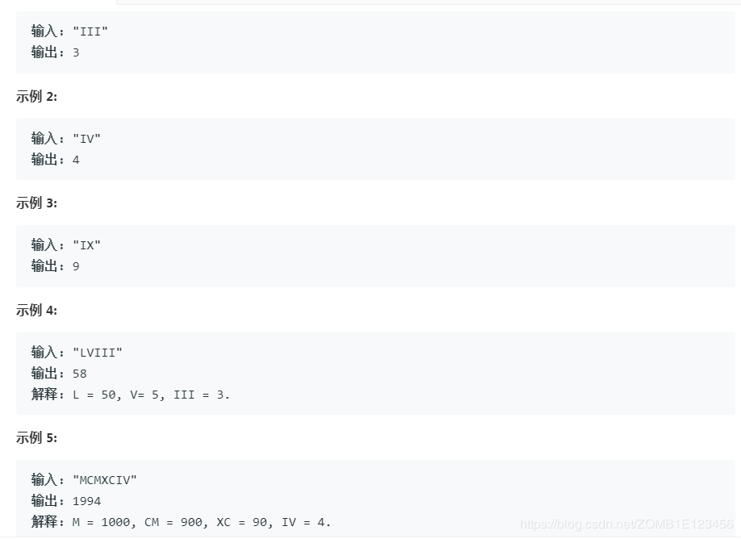
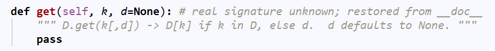

- [题目](#%e9%a2%98%e7%9b%ae)
- [解法1、字典map](#%e8%a7%a3%e6%b3%951%e5%ad%97%e5%85%b8map)
- [解法2、](#%e8%a7%a3%e6%b3%952)
- [出处](#%e5%87%ba%e5%a4%84)

# 题目



# 解法1、字典map

```python
class Solution:
    def romanToInt(self, s: str) -> int:
        numeral_map = {"I" : 1, "V" : 5, "X" : 10, "L" : 50, "C" : 100, "D" : 500, "M" : 1000}
        result = 0
        
        for i in range(len(s)):
            if i>0 and numeral_map[s[i]] > numeral_map[s[i-1]]:
                result += numeral_map[s[i]] - 2*numeral_map[s[i-1]]
            else:
                result += numeral_map[s[i]]
        
        return result
```
注意对i-1的元素要减两次

# 解法2、

```
class Solution:
    def romanToInt(self, s: str) -> int:
        d = {'I':1, 'IV':3, 'V':5, 'IX':8, 'X':10, 'XL':30, 'L':50, 'XC':80, 'C':100, 'CD':300, 'D':500, 'CM':800, 'M':1000}
        return sum([d.get(s[max(i-1, 0):i+1], d[n]) for i, n in enumerate(s)])
```
- 构建一个字典记录所有罗马数字子串，注意长度为2的子串记录的值是（实际值-子串内左边罗马数字代表的数值）
- 这样一来，遍历整个s的时候判断当前位置和前一个位置的两个字符组成的字符串是否在字典内，如果在就记录值，不在就说明当前位置不存在小数字在前面的情况，直接记录当前位置字符对应值
- 举个例子，遍历经过IV的时候先记录I的对应值1再往前移动一步记录IV的值3，加起来正好是IV的真实值4。max函数在这里是为了防止遍历第一个字符的时候出现[-1:0]的情况

1、列表生成式

2、dict.get()


3、循环或者切片等希望从0开始执行时，可借助max(i-1, 0)来达成

# 出处
1、https://www.bilibili.com/video/av45841108
2、对应题目下**Knife丶**的题解