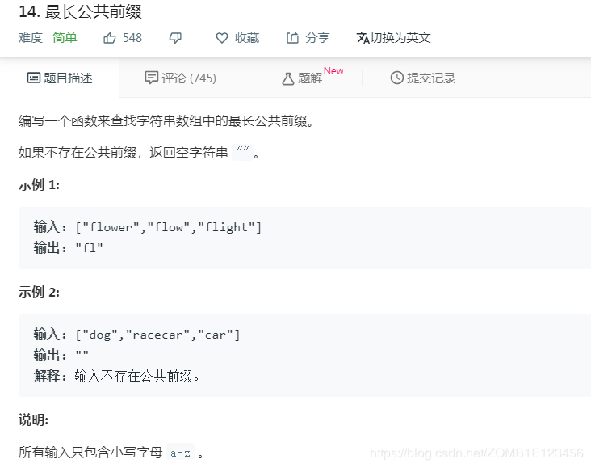
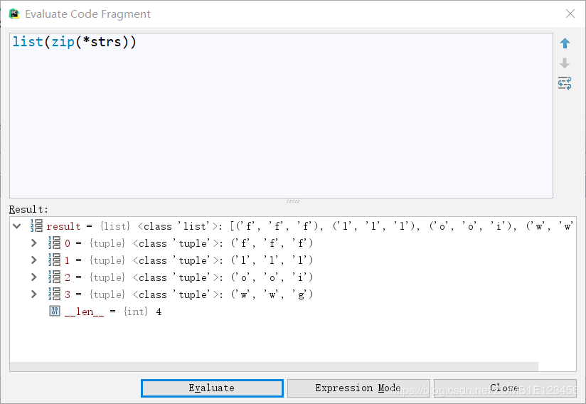
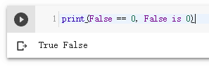
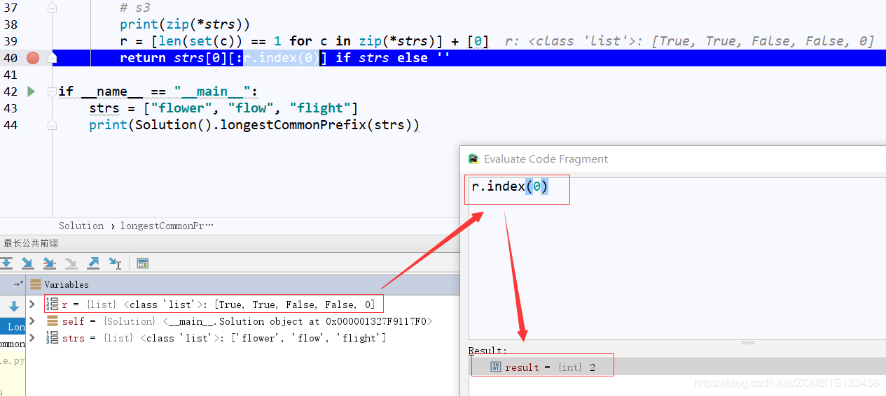

- [题目](#%e9%a2%98%e7%9b%ae)
- [解法1、逐位比较](#%e8%a7%a3%e6%b3%951%e9%80%90%e4%bd%8d%e6%af%94%e8%be%83)
- [解法2、利用集合性质](#%e8%a7%a3%e6%b3%952%e5%88%a9%e7%94%a8%e9%9b%86%e5%90%88%e6%80%a7%e8%b4%a8)
- [解法3、zip+sets](#%e8%a7%a3%e6%b3%953zipsets)
- [解法4、借助os模块自带函数。。。](#%e8%a7%a3%e6%b3%954%e5%80%9f%e5%8a%a9os%e6%a8%a1%e5%9d%97%e8%87%aa%e5%b8%a6%e5%87%bd%e6%95%b0)
- [出处](#%e5%87%ba%e5%a4%84)

# 题目


# 解法1、逐位比较

```python
class Solution:
    def longestCommonPrefix(self, strs):
        if not strs:
            return ""
        for i in range(len(strs[0])):
            for string in strs[1:]:
                if i >= len(string) or string[i] != strs[0][i]:
                    return strs[0][:i]
        return strs[0]# 当strs = [""]时，strs视为存在，所以此处我们直接返回第一个元素，即“”
```
以第一个单词作为基准，不同就返回前i位
注意第二个单词可能比第一个单词短，防止超出循环范围，先比较*i >= len(string)*

# 解法2、利用集合性质

```python
class Solution:
    def longestCommonPrefix(self, strs):
        result = ""
        i = 0
        while True:
            try:
                sets = set(string[i] for string in strs)
                if len(sets) == 1:
                    result += sets.pop()
                    i += 1
                else:
                    break
            except Exception as e:
                break
        return result
```
1、分别把所有单词的对应位放入集合，若集合长度不为1就返回
2、用while True时注意及时跳出，常借助try except

# 解法3、zip+sets

```python
class Solution:
    def longestCommonPrefix(self, strs):
        r = [len(set(c)) == 1 for c in zip(*strs)] + [0]
        return strs[0][:r.index(0)] if strs else ''
```
1、zip(*)解压，zip(*star)的结果（输入：strs = ["flower", "flow", "flight"]）

2、因为在python中0==False，此处index(0)结果为2



# 解法4、借助os模块自带函数。。。

```python
class Solution:
    def longestCommonPrefix(self, strs: List[str]) -> str:
        return os.path.commonprefix(strs)
```

# 出处
1、2、https://www.bilibili.com/video/av45842114
3、对应题目下**Knife丶**的题解