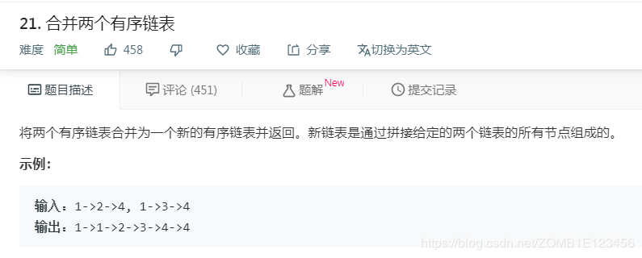

- [题目](#%e9%a2%98%e7%9b%ae)
- [解法1、](#%e8%a7%a3%e6%b3%951)
- [解法2、](#%e8%a7%a3%e6%b3%952)
- [出处](#%e5%87%ba%e5%a4%84)

# 题目

# 解法1、

```python
# Definition for singly-linked list.
# class ListNode:
#     def __init__(self, x):
#         self.val = x
#         self.next = None

class Solution:
    def mergeTwoLists(self, l1: ListNode, l2: ListNode) -> ListNode:
        curr = dummy = ListNode(0)
        while l1 and l2:
            if l1.val < l2.val:
                curr.next = l1
                l1 = l1.next
            else:
                curr.next = l2
                l2 = l2.next
            curr = curr.next
        curr.next = l1 or l2
        return dummy.next
if __name__ == "__main__":
    l1 = ListNode(1)
    l1.next = ListNode(2)
    l1.next.next = ListNode(4)
    l2 = ListNode(1)
    l2.next = ListNode(3)
    l2.next.next = ListNode(4)
    r = Solution().mergeTwoLists(l1, l2)

    while r:
        print(r.val)
        r = r.next
```
1、两个变量指向新链表，curr用来更新链表
# 解法2、

```python
# Definition for singly-linked list.
# class ListNode:
#     def __init__(self, x):
#         self.val = x
#         self.next = None

class Solution:
    def mergeTwoLists(self, l1: ListNode, l2: ListNode) -> ListNode:
        if l1 and l2:
            if l1.val > l2.val: l1, l2 = l2, l1
            l1.next = self.mergeTwoLists(l1.next, l2)
        return l1 or l2
```


# 出处
1、https://www.bilibili.com/video/av45843264
2、对应题目下**Knife丶**的题解