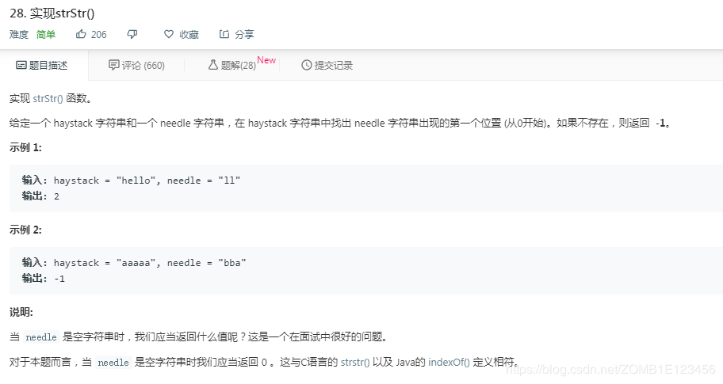

- [题目](#%e9%a2%98%e7%9b%ae)
- [解法1、](#%e8%a7%a3%e6%b3%951)
- [出处](#%e5%87%ba%e5%a4%84)

# 题目

# 解法1、

```python
class Solution:
    def strStr(self, haystack: str, needle: str) -> int:
        for i in range(len(haystack) - len(needle) + 1):
            if haystack[i:i+len(needle)] == needle:
                return i
        return -1
```

# 出处
1、对应题目下**Knife丶**的题解