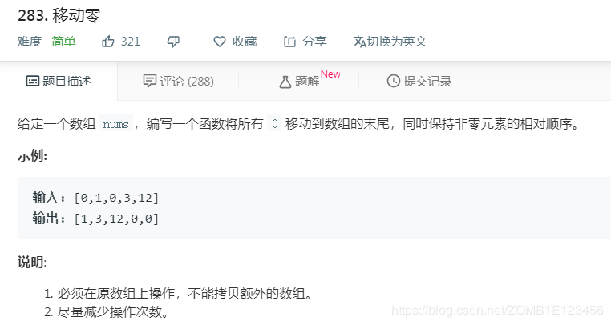

- [题目描述](#%e9%a2%98%e7%9b%ae%e6%8f%8f%e8%bf%b0)
- [注意点](#%e6%b3%a8%e6%84%8f%e7%82%b9)
- [解法1、利用位置标记替换元素后补0](#%e8%a7%a3%e6%b3%951%e5%88%a9%e7%94%a8%e4%bd%8d%e7%bd%ae%e6%a0%87%e8%ae%b0%e6%9b%bf%e6%8d%a2%e5%85%83%e7%b4%a0%e5%90%8e%e8%a1%a50)
- [解法2、借助filter和enumerate](#%e8%a7%a3%e6%b3%952%e5%80%9f%e5%8a%a9filter%e5%92%8cenumerate)
- [解法3、sort](#%e8%a7%a3%e6%b3%953sort)
- [出处](#%e5%87%ba%e5%a4%84)

# 题目描述


# 注意点
必须在原数组上操作，不能拷贝额外的数组
PS：修改nums即可，不必有新的返回值

# 解法1、利用位置标记替换元素后补0

```python
class Solution:
    def moveZeroes(self, nums: List[int]) -> None:
        """
        Do not return anything, modify nums in-place instead.
        """
        pos = 0
        for i in range(len(nums)):
            if nums[i]:
                nums[pos] = nums[i]
                pos += 1
        for i in range(pos, len(nums)):
            nums[i] = 0
```
在for循环的时候虽然会修改nums的内容，但是长度没变，所以不影响循环判断
# 解法2、借助filter和enumerate

```python
class Solution:
    def moveZeroes(self, nums: List[int]) -> None:
        """
        Do not return anything, modify nums in-place instead.
        """
        i = 0
        for i, n in enumerate(filter(lambda x: x, nums)):
            nums[i] = n
        for i in range(i + 1, len(nums)):
            nums[i] = 0
```
1、enumerate() 函数用于将一个可遍历的数据对象(如列表、元组或字符串)组合为一个索引序列，同时列出数据和数据下标，一般用在 for 循环当中。

*enumerate(sequence, [start=0])
sequence -- 一个序列、迭代器或其他支持迭代对象。
start -- 下标起始位置。*

2、filter() 函数用于过滤序列，过滤掉不符合条件的元素，返回由符合条件元素组成的新列表。

该接收两个参数，第一个为函数，第二个为序列，序列的每个元素作为参数传递给函数进行判，然后返回 True 或 False，最后将返回 True 的元素放到新列表中。

# 解法3、sort

```python
class Solution:
    def moveZeroes(self, nums: List[int]) -> None:
        """
        Do not return anything, modify nums in-place instead.
        """
        nums.sort(key=bool, reverse=True)
```

list.sort( key=None, reverse=False)

key -- 主要是用来进行比较的元素，只有一个参数，具体的函数的参数就是取自于可迭代对象中，指定可迭代对象中的一个元素来进行排序。
reverse -- 排序规则，reverse = True 降序， reverse = False 升序（默认）。


# 出处
1、https://www.bilibili.com/video/av50408908
2、3、对应题目下**Knife丶**的题解