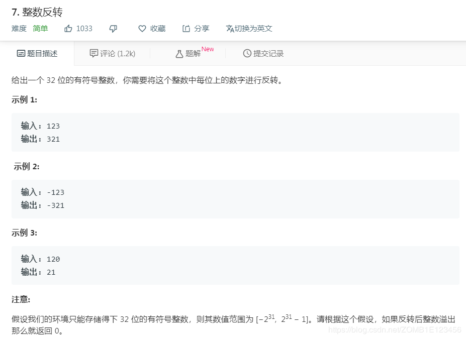

- [题目](#%e9%a2%98%e7%9b%ae)
- [解法1、利用数值反转数字](#%e8%a7%a3%e6%b3%951%e5%88%a9%e7%94%a8%e6%95%b0%e5%80%bc%e5%8f%8d%e8%bd%ac%e6%95%b0%e5%ad%97)
- [解法2、字符串反转](#%e8%a7%a3%e6%b3%952%e5%ad%97%e7%ac%a6%e4%b8%b2%e5%8f%8d%e8%bd%ac)
- [解法3、](#%e8%a7%a3%e6%b3%953)
- [出处](#%e5%87%ba%e5%a4%84)

# 题目


# 解法1、利用数值反转数字

```python
class Solution:
    def reverse(self, x: int) -> int:
        num = 0
        a = abs(x)
        while(a!=0):
            temp = a % 10
            num = num * 10 + temp
            a = a // 10
        if x > 0 and num < 2**31:
            return num
        elif x < 0 and num <= 2**31:
            return -num
        else:
            return 0
```
借助temp反转数字

# 解法2、字符串反转

```python
class Solution:
    def reverse(self, x: int) -> int:
        abs_num = abs(x)
        abs_num_ = int(str(abs_num)[::-1])
        
        if abs_num_<-2**31 or abs_num_>2**31-1:
            return 0
        if x<0:
            return -abs_num_
        return abs_num_
```

# 解法3、

```python
class Solution:
    def reverse(self, x):
        r = x // max(1, abs(x)) * int(str(abs(x))[::-1])
        return r if r.bit_length() < 32 or r == -2**31 else 0
```
- x // max(1, abs(x))意味着 0：x为0， 1：x为正， -1：x为负，相当于被废弃的函数cmp
- [::-1]代表序列反转
- 2^31 和 -2^31 的比特数为32，其中正负号占用了一位
- 32位整数范围 [−2^31， 2^31 − 1] 中正数范围小一个是因为0的存在
# 出处
1、https://www.bilibili.com/video/av45840031
3、对应题目下**Knife丶**的题解
