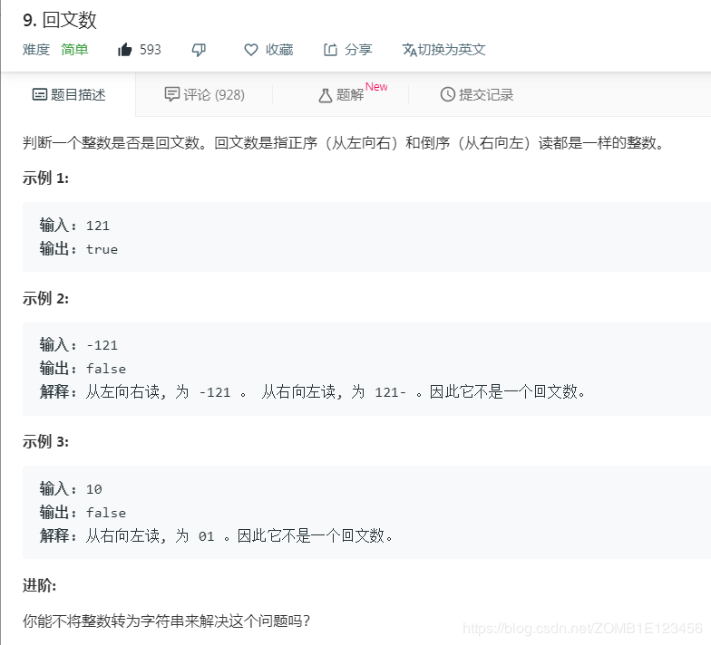

- [题目](#%e9%a2%98%e7%9b%ae)
- [解法1、计算反序的值](#%e8%a7%a3%e6%b3%951%e8%ae%a1%e7%ae%97%e5%8f%8d%e5%ba%8f%e7%9a%84%e5%80%bc)
- [解法2、字符串逆序比较](#%e8%a7%a3%e6%b3%952%e5%ad%97%e7%ac%a6%e4%b8%b2%e9%80%86%e5%ba%8f%e6%af%94%e8%be%83)
- [解法3、](#%e8%a7%a3%e6%b3%953)
- [解法4、](#%e8%a7%a3%e6%b3%954)
- [出处](#%e5%87%ba%e5%a4%84)
# 题目


# 解法1、计算反序的值

```python
class Solution:
    def isPalindrome(self, x: int) -> bool:
        num = 0
        a = abs(x)
        
        while(a!=0):
            temp = a % 10
            num = num * 10 + temp
            a = a // 10
        
        if x >= 0 and x == num:
            return True
        else:
            return False
```

# 解法2、字符串逆序比较

```python
class Solution:
    def isPalindrome(self, x: int) -> bool:
        if x >= 0 and int(str(x)[::-1]) == x:
            return True
        else:
            return False
```

# 解法3、

```python
class Solution:
    def isPalindrome(self, x: int) -> bool:
        return str(x) == str(x)[::-1]
```
# 解法4、

```Python
class Solution:
    def isPalindrome(self, x: int) -> bool:
        r = list(map(lambda i: int(10**-i * x % 10), range(int(math.log10(x)), -1, -1))) if x > 0 else [0, x]
        return r == r[::-1]
```
- 思路是一样的，这里把整数转成了列表而不是字符串
- 比如一个整数12321，我想取出百位数可以这么做：12321 * 10^{int(log_{10}12321)} % 10 = 123 % 10 = 3


1、map() 会根据提供的函数对指定序列做映射。
第一个参数 function 以参数序列中的每一个元素调用 function 函数，返回包含每次 function 函数返回值的新列表。

*map(function, iterable, ...)
function -- 函数
iterable -- 一个或多个序列*

2、

# 出处
1、https://www.bilibili.com/video/av45840363
3、4、对应题目下**Knife丶**的题解