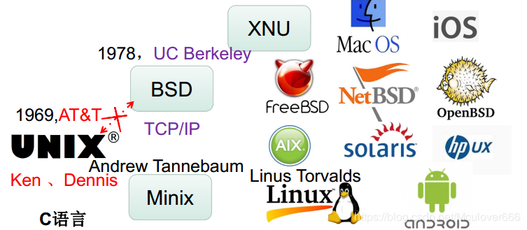
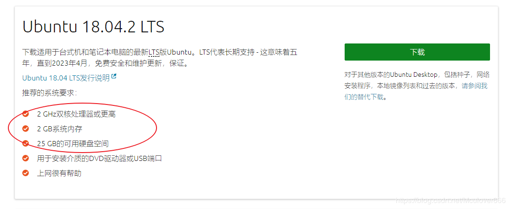
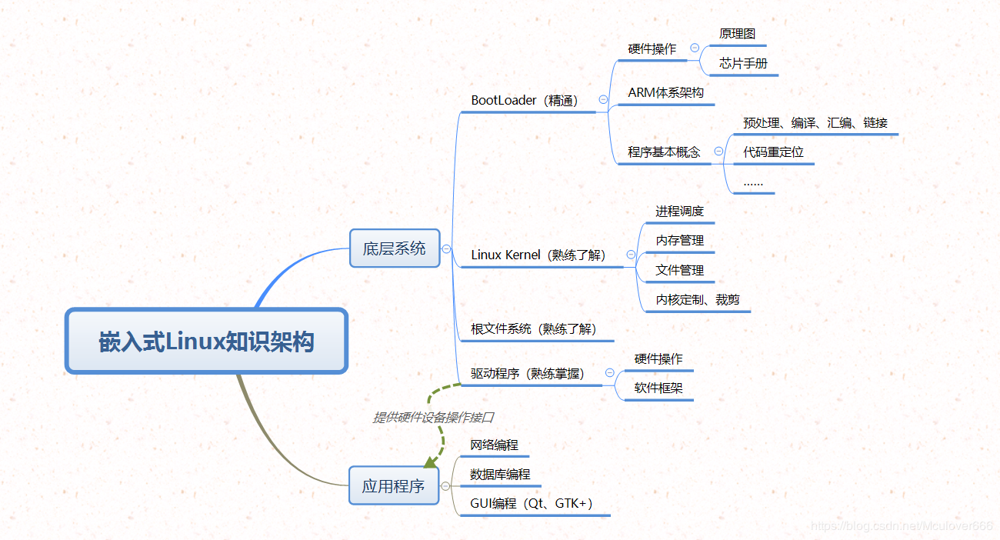

对于任何一个研发人员来说，Linux是最强大的操作系统，没有之一！为什么这么说呢，原因有下：

- 高效： 简单粗暴有效的命令可以高效的完成很多的日常开发工作
- 稳定：Linux运行的稳定性能用来作后台服务器再好不过了
- 安全：Linux开源，由很多的开发者共同维护，所以可利用漏洞少之又少
- 开放：Linux源码开放
- 多用户：真正的可以多用户同时工作

那么这么强大的一个系统因何而来呢？

## 1.GNU/Linux的诞生
1969年AT&T（美国贝尔实验室）有两个人——**Ken，Dennis**为了适配他们的游戏而研发出了**Unix操作系统**，并且抛弃了汇编，顺便发明了**C语言**，用C完成了整个操作系统，而Unix就是这个话题中的万恶之源~

其实Unix是开源免费的，因为它只是单机版，没有太大的作用，一段时间后在UC Berkeley诞生出了伟大的TCP/IP协议，使得所有的计算机都可以很好地连通，Unix演变成了BSD，以至于后来的FreeBSD，NetBSD，MacOS，iOS等等……

然而别忘了，这一切的起源是Unix，当然不可能看着BSD就这么火，Unix开始收费了，对于公司而言，收费就收费呗，无非成本价有点高，然而别忘了还有我们这群苦逼的学生，又想学习使用Unix，又买不起Unix，所以美国一个计算机科学教授Andrew Tnanebaum根据Unix写出了**Minix**操作系统用来教学，青出于蓝而胜于蓝，1991年美国大二学生**Linus Torvalds**觉得Minix不太行，所以自己写了一个**Linux内核**，然而它再强大，也只是一个内核~

凑巧的是，在那个年代**GNU**（GNU is Not Uinx）也是一个致力于自由的类unix操作系统，它发展了几乎内核以外的所有软件，并且创建了通用软件许可证**GPL**（General Public License） —— 免费得到源码永久使用权、可以任意修改、但是有义务公开修改后的代码~
于是乎，Linux和GNU一拍即合，天造地设的一对就这样诞生了，强强联手，演变成现在最强大的操作系统 —— **GNU/Linux**。

## 2.GNU/Linux衍生的发行版
当然，Linux内核和GNU合起来也还不够，对于用户的使用，还应包含命令行Shell或桌面环境（KDE、GNOME、Unity等），所以就衍生出来很多的Linux发行版，主要有三大分支：

- redhat
- debian
- openSUSE

这些发行版如果按应用场景来分，主要有两类：

- 以命令行Shell为主的服务器发行版：CentOS/RHEL、openSUSE、Ubuntu Server
- 以桌面环境为主的桌面发行版：Ubuntu、Linux Mint、Fedora
## 3. 嵌入式Linux
标准Linux运行在通用计算机上或者云端，虽然包含了很多功能，但是需要的硬件配置较高，如图是Ubuntu 18.04.2 LTS发行版需要的系统要求：

在资源极其有限的嵌入式系统中，显然这样的性能是绝对不可能满足的，那么，如何使强大的Linux内核应用在嵌入式系统中呢？

嵌入式系统有一个非常鲜明的特点 —— 通常都是针对某一个具体应用，所以将标准的Linux根据情况进行裁剪，只保留需要的功能（比如路由器中运行的Linux就不需要界面功能），因此只需要少量的Flash和RAM就可以完美的运行在嵌入式设备中。

## 4.嵌入式Linux知识架构

## 5.如何学Linux
如此强大有效的一个操作系统，仅作学习之用的话选择其中一个自己喜欢的发行版就好，我的学习旅程是：

首先在虚拟机上学习：

- 会操作：基本Linux命令，Linux文件系统
- 会编程：shell脚本编程，基本C编程，网络编程，GUI编程
然后在开发板上学习，选用ARM9或ARM11：

- 会启动：移植并成功启动
- 会驱动：可以编写常见驱动程序
--------------------- 
作者：Mculover666 
来源：CSDN 
原文：https://blog.csdn.net/Mculover666/article/details/87558456 