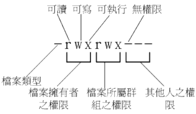

- [目录结构（逐步完善）](#%e7%9b%ae%e5%bd%95%e7%bb%93%e6%9e%84%e9%80%90%e6%ad%a5%e5%ae%8c%e5%96%84)
- [**Linux基础**](#linux%e5%9f%ba%e7%a1%80)
  - [tips](#tips)
  - [学习步骤](#%e5%ad%a6%e4%b9%a0%e6%ad%a5%e9%aa%a4)
- [**Linux指令**](#linux%e6%8c%87%e4%bb%a4)
  - [基础指令](#%e5%9f%ba%e7%a1%80%e6%8c%87%e4%bb%a4)
  - [查找相关指令用法](#%e6%9f%a5%e6%89%be%e7%9b%b8%e5%85%b3%e6%8c%87%e4%bb%a4%e7%94%a8%e6%b3%95)
- [**关机相关**](#%e5%85%b3%e6%9c%ba%e7%9b%b8%e5%85%b3)
  - [CentOS界面相关](#centos%e7%95%8c%e9%9d%a2%e7%9b%b8%e5%85%b3)
- [**权限相关**](#%e6%9d%83%e9%99%90%e7%9b%b8%e5%85%b3)
  - [更改权限](#%e6%9b%b4%e6%94%b9%e6%9d%83%e9%99%90)

# 目录结构（逐步完善）
- `/` （root, 根目录） ：与开机系统有关；
- `/usr` （unix software resource） ：与软件安装/执行有关；
- `/var` （variable） ：与系统运行过程有关。

- `/usr` （软件放置处） 
- `/etc` （配置文件）
- `/opt` （第三方协力软件） 
- `/boot` （开机与核心档）
- `/var/mail` （使用者邮件信箱） 
- `/var/run` （程序相关）
- `/var/spool/news` （新闻群组） 
- `/var/lock` （程序相关）

- `/usr/share/doc`  存放各个命令的说明文档
- `/etc/group`  存放群组信息
- `/etc/passwd` 存放帐号
- `/var/log/wtmp`  登录的数据记录
- `/dev/sda`    设备文件
- 

# **Linux基础**
## tips

- 安卓算linux核心的一个分支，专门用来针对手机平板这种arm机器设计的
- 学习这些基础知识也是为了让自己能掌握搜索的keyword
- 一切皆文件
- /usr算可执行程序及相关的文件摆放目录

## 学习步骤

- 计算机硬件知识（基本OK）
- 指令
- 权限、user
- shell、shell script
- 网络基础的创建
- 架站

硬件相关

- 操作系统也是软件，是通过嵌入硬件的BIOS的调用的

# **Linux指令**

## 基础指令

|              指令               |           效果           |
| :-----------------------------: | :----------------------: |
|              date               |      显示日期与时间      |
|               cal               |         显示日历         |
|               bc                |          计算器          |
|            [Ctrl]-c             |       中断目前程序       |
| [shift]+{[PageUP]\|[Page Down]} | 在**纯文本**的画面中翻页 |

## 查找相关指令用法
1、--help

2、man(manual操作说明)

3、info的信息是分段的，类似man

4、`/usr/share/doc`下查阅

# **关机相关**
- 将数据同步写入硬盘中的指令： sync

建议多次使用
- 惯用的关机指令： shutdown

加`-c`可以取消关机
- 重新开机，关机： reboot, halt, poweroff

## CentOS界面相关
Linux默认的情况下会提供六个Terminal来让使用者登陆， 切换的方式为使用：[Ctrl] + [Alt] + [F1]~[F6]的组合按钮，系统会将[F1] /~ [F6]命名为**tty1 ~ tty6**的操作接口环境。tty2/~tty6一开始是不存在的！按下 [ctrl]+[alt]+[F2]，系统才产生出额外的 tty2, tty3。

启动窗口界面：`startx`

# **权限相关**
User, Group, Others

档案类型标志位含义：
- 当为[ d ]则是目录，例如上表文件名为“.config”的那一行；
- 当为[ - ]则是文件，例如上表文件名为“initial-setup-ks.cfg”那一行；
- 若是[ l ]则表示为链接文件（link file） ；
- 若是[ b ]则表示为设备文件里面的可供储存的周边设备（可随机存取设备） ；
- 若是[ c ]则表示为设备文件里面的序列埠设备，例如键盘、鼠标（一次性读取设备） 。

## 更改权限
- chgrp ：改变文件所属群组
    - eg:`chgrp users foo1.txt`
    - 群组相关存放在`/etc/groupp`内
- chown ：改变文件拥有者
    - 帐号相关存放在`/etc/passwd`
- chmod ：改变文件的权限, SUID, SGID, SBIT等等的特性
    - `> r:4 > w:2 > x:1`
    - `> owner = rwx = 4+2+1 = 7 > group = rwx = 4+2+1 = 7 > others= --- = 0+0+0 = 0`
    - `| chmod | u g o a | +（加入） -（除去） =（设置） | r w x | 文件或目录 |`

