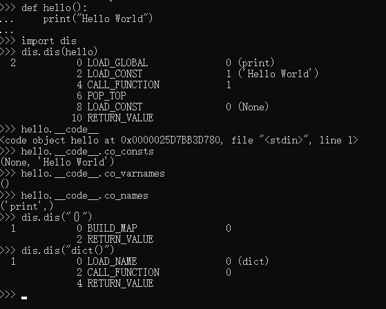

- [了解 Python 字节码是什么，Python 如何使用它来执行你的代码，以及知道它是如何帮到你的。](#%e4%ba%86%e8%a7%a3-python-%e5%ad%97%e8%8a%82%e7%a0%81%e6%98%af%e4%bb%80%e4%b9%88python-%e5%a6%82%e4%bd%95%e4%bd%bf%e7%94%a8%e5%ae%83%e6%9d%a5%e6%89%a7%e8%a1%8c%e4%bd%a0%e7%9a%84%e4%bb%a3%e7%a0%81%e4%bb%a5%e5%8f%8a%e7%9f%a5%e9%81%93%e5%ae%83%e6%98%af%e5%a6%82%e4%bd%95%e5%b8%ae%e5%88%b0%e4%bd%a0%e7%9a%84)
- [Python 如何工作](#python-%e5%a6%82%e4%bd%95%e5%b7%a5%e4%bd%9c)
- [Python 虚拟机内幕](#python-%e8%99%9a%e6%8b%9f%e6%9c%ba%e5%86%85%e5%b9%95)
- [访问和理解 Python 字节码](#%e8%ae%bf%e9%97%ae%e5%92%8c%e7%90%86%e8%a7%a3-python-%e5%ad%97%e8%8a%82%e7%a0%81)
- [字节码的用处](#%e5%ad%97%e8%8a%82%e7%a0%81%e7%9a%84%e7%94%a8%e5%a4%84)
- [延伸阅读](#%e5%bb%b6%e4%bc%b8%e9%98%85%e8%af%bb)
- [原文](#%e5%8e%9f%e6%96%87)
- [感想](#%e6%84%9f%e6%83%b3)


# 了解 Python 字节码是什么，Python 如何使用它来执行你的代码，以及知道它是如何帮到你的。

如果你曾经编写过 Python，或者只是使用过 Python，你或许经常会看到 Python 源代码文件——它们的名字以 .py 结尾。

你可能还看到过其它类型的文件，比如以 .pyc 结尾的文件，或许你可能听说过它们就是 Python 的 “字节码bytecode” 文件。（在 Python 3 上这些可能不容易看到 —— 因为它们与你的 .py 文件不在同一个目录下，它们在一个叫 __pycache__ 的子目录中）

或者你也听说过，这是节省时间的一种方法，它可以避免每次运行 Python 时去重新解析源代码。

但是，除了 “噢，原来这就是 Python 字节码” 之外，你还知道这些文件能做什么吗？以及 Python 是如何使用它们的？

如果你不知道，那你走运了！今天我将带你了解 Python 的字节码是什么，Python 如何使用它去运行你的代码，以及知道它是如何帮助你的。

# Python 如何工作
Python 经常被介绍为它是一个解释型语言 —— 其中一个原因是在程序运行时，你的源代码被转换成 CPU 的原生指令 —— 但这样的看法只是部分正确。Python 与大多数解释型语言一样，确实是**将源代码编译为一组虚拟机指令**，并且 Python 解释器是针对相应的虚拟机实现的。这种中间格式被称为 “字节码”。

因此，这些 .pyc 文件是 Python 悄悄留下的，是为了让它们运行的 “更快”，或者是针对你的源代码的 “优化” 版本；它们是你的程序在 Python 虚拟机上运行的字节码指令。

我们来看一个示例。这里是用 Python 写的经典程序 “Hello, World!”：
```python
def hello()
    print("Hello, World!")
```
下面是转换后的字节码（转换为人类可读的格式）：
```python
2           0 LOAD_GLOBAL              0 (print)
            2 LOAD_CONST               1 ('Hello, World!')
            4 CALL_FUNCTION            1
```
如果你输入那个 hello() 函数，然后使用 CPython 解释器去运行它，那么上述列出的内容就是 Python 所运行的。它看起来可能有点奇怪，因此，我们来深入了解一下它都做了些什么。

# Python 虚拟机内幕
CPython 使用一个基于栈的虚拟机。也就是说，它完全面向栈数据结构的（你可以 “推入” 一个东西到栈 “顶”，或者，从栈 “顶” 上 “弹出” 一个东西来）。

CPython 使用三种类型的栈：

- 调用栈`call stack`。这是运行 Python 程序的主要结构。它为每个当前活动的函数调用使用了一个东西 —— “帧frame”，栈底是程序的入口点。每个函数调用推送一个新的帧到调用栈，每当函数调用返回后，这个帧被销毁。

- 在每个帧中，有一个计算栈`evaluation stack` （也称为数据栈`data stack`）。这个栈就是 Python 函数运行的地方，运行的 Python 代码大多数是由推入到这个栈中的东西组成的，操作它们，然后在返回后销毁它们。

- 在每个帧中，还有一个块栈`block stack`。它被 Python 用于去跟踪某些类型的控制结构：循环、try / except 块、以及 with 块，全部推入到块栈中，当你退出这些控制结构时，块栈被销毁。这将帮助 Python 了解任意给定时刻哪个块是活动的，比如，一个 continue 或者 break 语句可能影响正确的块。
大多数 Python 字节码指令操作的是当前调用栈帧的计算栈，虽然，还有一些指令可以做其它的事情（比如跳转到指定指令，或者操作块栈）。


为了更好地理解，假设我们有一些调用函数的代码，比如这个：`my_function(my_variable, 2)`。Python 将转换为一系列字节码指令：

- 一个 `LOAD_NAME` 指令去查找函数对象 `my_function`，然后将它推入到计算栈的顶部
- 另一个 `LOAD_NAME` 指令去查找变量 `my_variable`，然后将它推入到计算栈的顶部
- 一个 `LOAD_CONST` 指令去推入一个实整数值 2 到计算栈的顶部
- 一个 `CALL_FUNCTION` 指令

这个 CALL_FUNCTION 指令将有 2 个参数，它表示那个 Python 需要从栈顶弹出两个位置参数；然后函数将在它上面进行调用，并且它也同时被弹出（对于函数涉及的关键字参数，它使用另一个不同的指令 —— CALL_FUNCTION_KW，但使用的操作原则类似，以及第三个指令 —— CALL_FUNCTION_EX，它适用于函数调用涉及到参数使用 * 或 ** 操作符的情况）。一旦 Python 拥有了这些之后，它将在调用栈上分配一个新帧，填充到函数调用的本地变量上，然后，运行那个帧内的 my_function 字节码。运行完成后，这个帧将被调用栈销毁，而在最初的帧内，my_function 的返回值将被推入到计算栈的顶部。

# 访问和理解 Python 字节码
如果你想玩转字节码，那么，Python 标准库中的 dis 模块将对你有非常大的帮助；dis 模块为 Python 字节码提供了一个 “反汇编”，它可以让你更容易地得到一个人类可读的版本，以及查找各种字节码指令。dis 模块的文档 可以让你遍历它的内容，并且提供一个字节码指令能够做什么和有什么样的参数的完整清单。

例如，获取上面的 `hello()` 函数的列表，可以在一个 Python 解析器中输入如下内容，然后运行它：

```python
import dis
dis.dis(hello)
```
函数 dis.dis() 将反汇编一个**函数、方法、类、模块、编译过的 Python 代码对象、或者字符串包含的源代码**，以及显示出一个人类可读的版本。dis 模块中另一个方便的功能是 distb()。你可以给它传递一个 Python 追溯对象，或者在发生预期外情况时调用它，然后它将在发生预期外情况时反汇编调用栈上最顶端的函数，并显示它的字节码，以及插入一个指向到引发意外情况的指令的指针。

它也可以用于查看 Python 为每个函数构建的编译后的代码对象，因为运行一个函数将会用到这些代码对象的属性。这里有一个查看 `hello()` 函数的示例：
```python
>>> hello.__code__
<code object hello at 0x104e46930, file "<stdin>", line 1>
>>> hello.__code__.co_consts
(None, 'Hello, World!')
>>> hello.__code__.co_varnames
()
>>> hello.__code__.co_names
('print',)
```
代码对象在函数中可以以属性 __code__ 来访问，并且携带了一些重要的属性：

- `co_consts` 是存在于函数体内的任意**实数**的元组
- `co_varnames` 是函数体内使用的包含任意本地**变量名字**的元组
- `co_names` 是在函数体内引用的任意**非本地名字**的元组
许多字节码指令 —— 尤其是那些推入到栈中的加载值，或者在变量和属性中的存储值 —— 在这些元组中的索引作为它们参数。

因此，现在我们能够理解 `hello()` 函数中所列出的字节码：

- `LOAD_GLOBAL 0`：告诉 Python 通过 co_names （它是 print 函数）的索引 0 上的名字去查找它指向的全局对象，然后将它推入到计算栈
- `LOAD_CONST 1`：带入 co_consts 在索引 1 上的字面值，并将它推入（索引 0 上的字面值是 None，它表示在 co_consts 中，因为 Python 函数调用有一个隐式的返回值 None，如果没有显式的返回表达式，就返回这个隐式的值 ）。
- `CALL_FUNCTION 1`：告诉 Python 去调用一个函数；它需要从栈中弹出一个位置参数，然后，新的栈顶将被函数调用。


“原始的” 字节码 —— 是非人类可读格式的字节 —— 也可以在代码对象上作为 co_code 属性可用。如果你有兴趣尝试手工反汇编一个函数时，你可以从它们的十进制字节值中，使用列出 dis.opname 的方式去查看字节码指令的名字。

# 字节码的用处
现在，你已经了解的足够多了，你可能会想 “OK，我认为它很酷，但是知道这些有什么实际价值呢？”由于对它很好奇，我们去了解它，但是除了好奇之外，Python 字节码在几个方面还是非常有用的。

首先，理解 Python 的**运行模型**可以帮你更好地理解你的代码。人们都开玩笑说，C 是一种 “可移植汇编器”，你可以很好地猜测出一段 C 代码转换成什么样的机器指令。理解 Python 字节码之后，你在使用 Python 时也具备同样的能力 —— 如果你能预料到你的 Python 源代码将被转换成什么样的字节码，那么你可以知道如何更好地写和优化 Python 源代码。

第二，理解字节码可以帮你更好地回答有关 Python 的问题。比如，我经常看到一些 Python 新手困惑为什么某些结构比其它结构运行的更快（比如，为什么 {} 比 dict() 快）。知道如何去访问和阅读 Python 字节码将让你很容易回答这样的问题（尝试对比一下： dis.dis("{}") 与 dis.dis("dict()") 就会明白）。

最后，理解字节码和 Python 如何运行它，为 Python 程序员不经常使用的一种特定的编程方式提供了有用的视角：面向栈的编程。如果你以前从来没有使用过像 FORTH 或 Fator 这样的面向栈的编程语言，它们可能有些古老，但是，如果你不熟悉这种方法，学习有关 Python 字节码的知识，以及理解面向栈的编程模型是如何工作的，将有助你开拓你的编程视野。

# 延伸阅读
如果你想进一步了解有关 Python 字节码、Python 虚拟机、以及它们是如何工作的更多知识，我推荐如下的这些资源：

- Python 虚拟机内幕，它是 Obi Ike-Nwosu 写的一本免费在线电子书，它深入 Python 解析器，解释了 Python 如何工作的细节。
- 一个用 Python 编写的 Python 解析器，它是由 Allison Kaptur 写的一个教程，它是用 Python 构建的 Python 字节码解析器，并且它实现了运行 Python 字节码的全部构件。
- 最后，CPython 解析器是一个开源软件，你可以在 GitHub 上阅读它。它在文件 Python/ceval.c 中实现了字节码解析器。这是 Python 3.6.4 发行版中那个文件的链接；字节码指令是由第 1266 行开始的 switch 语句来处理的。

# 原文
转自：https://linux.cn/article-9816-1.html

英文原文：https://opensource.com/article/18/4/introduction-python-bytecode

# 感想

- 也就是说pvm其实都是用的都是栈，编译成pyc的时候其实是把这些都分配进各个栈，然后执行（解释）字节码的时候再去找相应的栈区吗？
- 也就是说：文中没提到的第6行字节码`POP_TOP`，出栈，而出的栈是一个CALL_FUNCTION,所以他会继续把('Hello World')和(print)一起出栈？然后最后RETURN_VALUE？
- {}比dict()快 是因为{}栈直接调用，dict()多了一个函数的栈调用？
  - 有人说：核心思想，dict是全局函数，查找比较慢。不如用常量。类似其他全局函数都可以转成局部的适当提速
  - 也就是从表现上来说，是因为栈中多了一个CALL_FUNCTION，而实际原因是会去搜一下dict这个函数
