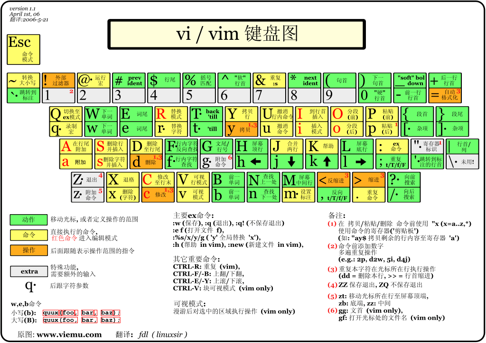

- [模式](#%e6%a8%a1%e5%bc%8f)
  - [模式切换](#%e6%a8%a1%e5%bc%8f%e5%88%87%e6%8d%a2)
- [移动](#%e7%a7%bb%e5%8a%a8)
- [操作](#%e6%93%8d%e4%bd%9c)
- [搜索](#%e6%90%9c%e7%b4%a2)

# 模式

- Normal（普通模式）
- Insert（插入模式）
- Visual（可视模式）

## 模式切换

普通→==插入==

| 按键  |         描述         |  助记  |
| :---: | :------------------: | :----: |
|  `i`  | 在当前光标字符前插入 | insert |
|  `a`  | 在当前光标字符后插入 | append |
|  `I`  |    在当前行首插入    | Insert |
|  `A`  |    在当前行尾插入    | Append |
|  `o`  | 在下方开一新行，插入 |  open  |
|  `O`  | 在上方开一新行，插入 |  Open  |

普通模式切换到==可视模式==，按键就比较单一了，比较常用的是：

|    按键    |                   描述                   |  助记  |
| :--------: | :--------------------------------------: | :----: |
|    `v`     |     选中当前光标字符，并进入可视模式     | visual |
|    `V`     | 不同于小写 `v`，这时移动光标只会按行选择 | Visual |
| `<Ctrl-v>` | 块选择模式，此时移动光标会选择一个矩形块 |        |

可视模式切换到输入模式一般有以下几种情况：

| 按键  |                   描述                   |  助记  |
| :---: | :--------------------------------------: | :----: |
|  `s`  | ==删除==当前已选择的内容，并进入插入模式 |        |
|  `c`  |   删除当前已选择的内容，并进入插入模式   | change |
| `di`  |   删除当前已选择的内容，并进入插入模式   |        |

可视模式回到普通模式也有很多方式，比较直接的就是`<ESC>`，当然，还有其他一些按键：

| 按键  |                   描述                   | 助记  |
| :---: | :--------------------------------------: | :---: |
|  `y`  |   ==复制==当前选择区域，并退出可视模式   | yank  |
|  `Y`  | 复制当前选择区域（按行），并退出可视模式 | Yank  |

# 移动

- 数字n+移动命令     移动n个位置

| 按键  |                描述                 |   助记    |
| :---: | :---------------------------------: | :-------: |
|  `0`  | 跳到==行首==，可以理解为无穷大的`h` |           |
|  `^`  |   跳到行首开始的第一个非空白字符    |           |
|  `$`  | 跳到==行尾==，可以理解为无穷大的`l` |           |
| `gg`  | 跳到==首行==，可以理解为无穷大的`k` |           |
|  `G`  | 跳到==末行==，可以理解为无穷大的`j` |           |
|  `w`  |           跳到下一个词首            |   word    |
|  `b`  |           跳到上一个词首            | back-word |
|  `e`  |           跳到下一个词尾            |    end    |
| `ge`  |           跳到上一个词尾            |           |

# 操作

| 按键  |         描述         |  助记  |
| :---: | :------------------: | :----: |
|  `c`  | 删除，并进入插入模式 | change |
|  `d`  |         删除         | delete |
|  `y`  |         复制         |  yank  |
| `gu`  |     变为小写字母     |        |
| `gU`  |     变为大写字母     |        |
| `g~`  |   颠倒字母的大小写   |        |
|  `>`  |        右缩进        |        |
|  `<`  |        左缩进        |        |
|  `=`  |       自动缩进       |        |

# 搜索
/word   搜索
