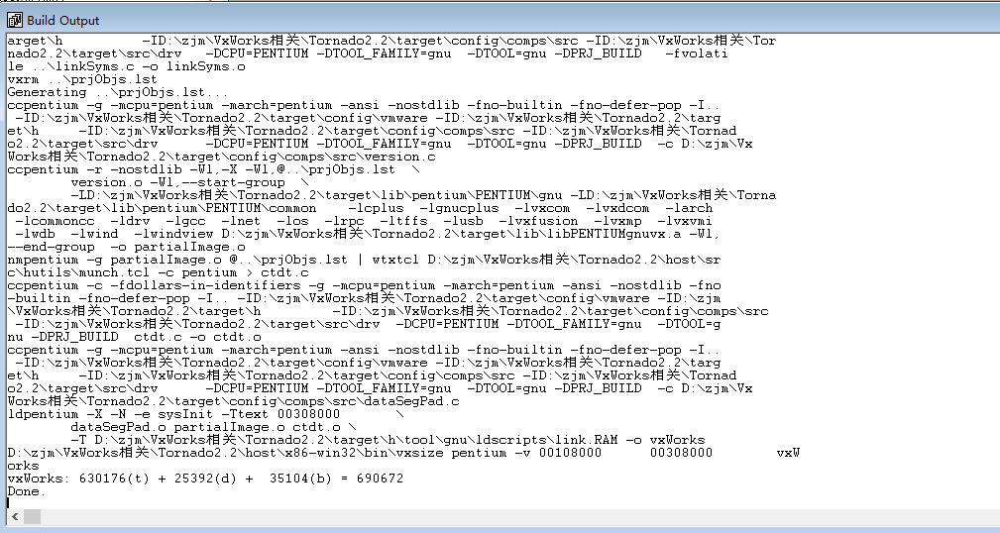

- [build报错“unable to allocate heap”](#build%e6%8a%a5%e9%94%99unable-to-allocate-heap)
- [解决方法](#%e8%a7%a3%e5%86%b3%e6%96%b9%e6%b3%95)
- [原因分析](#%e5%8e%9f%e5%9b%a0%e5%88%86%e6%9e%90)
- [参考](#%e5%8f%82%e8%80%83)

# build报错“unable to allocate heap”
按照原帖[VxWorks+Tornado从听说到入门](https://www.jianshu.com/p/d156809e0e64)的相关步骤在win10下，进行到“使用篇、step4、build vxworks”时，会有以下报错
```
wtxtcl D:\zjm\VxWorks相关\Tornado2.2\host\src\hutils\configGen.tcl ..\Project0.wpj
ccpentium -c -g -mcpu=pentium -march=pentium -ansi -nostdlib -fno-builtin -fno-defer-pop - 
P -xassembler-with-cpp -I.. -ID:\zjm\VxWorks相关\Tornado2.2\target\config\vmware -ID:\zjm\ 
VxWorks相关\Tornado2.2\target\h 	 -ID:\zjm\VxWorks相关\Tornado2.2\target\config\comps\src  
-ID:\zjm\VxWorks相关\Tornado2.2\target\src\drv	 -DCPU=PENTIUM -DTOOL_FAMILY=gnu  -DTOOL=gn 
u -DPRJ_BUILD   -fvolatile D:\zjm\VxWorks相关\Tornado2.2\target\config\vmware\sysALib.s -o 
 sysALib.o
ccpentium -c -g -mcpu=pentium -march=pentium -ansi -nostdlib -fno-builtin -fno-defer-pop - 
I.. -ID:\zjm\VxWorks相关\Tornado2.2\target\config\vmware -ID:\zjm\VxWorks相关\Tornado2.2\t 
arget\h 	 -ID:\zjm\VxWorks相关\Tornado2.2\target\config\comps\src -ID:\zjm\VxWorks相关\Tor 
nado2.2\target\src\drv	 -DCPU=PENTIUM -DTOOL_FAMILY=gnu  -DTOOL=gnu -DPRJ_BUILD   -fvolati 
le D:\zjm\VxWorks相关\Tornado2.2\target\config\vmware\ln97xEnd.c -o ln97xEnd.o
d:\zjm\VxWorks相关\Tornado2.2\host\x86-win32\lib\gcc-lib\i586-wrs-vxworks\2.9-PentiumIII-0 
10221\cc1.exe: *** 2. unable to allocate heap, heap_chunk_size 587202560, Win32 error 0
make: *** [ln97xEnd.o] Error 0x1

Done.
```
看提示是说无法分配堆，似乎是太大了

# 解决方法
借助visio studio的命令行工具修改cc1.exe的二进制文件

首先打开命令行工具

进入到目录：`xxx\Tornado2.2\host\x86-win32\lib\gcc-lib\i586-wrs-vxworks\2.9-PentiumIII-010221`依次输入如下命令
```bash
dumpbin /HEADERS cc1.exe
editbin /STACK:67108864 cc1.exe
dumpbin /HEADERS cc1plus.exe
editbin /STACK:67108864 cc1plus.exe
```
然后再次进行build

# 原因分析
在从在WindowsXP 32位编译到Windows 7 64位的过程中，发现GCC 2.96为PowerPC编写的cc1.exe程序失败了，在一些编译中也出现了同样的错误。使用VisualStudio调试器附加到cc1.exe并使用Sysinals工具进行监视的调查表明：

1、当cc1.exe程序成功时，它会产生3个线程。

2、当cc1.exe程序失败时，第三个CreateThread()调用失败ERROR_NOT_ENOUGH_MEMORY.

3、运行VisualStudio时报告的cc1.exe图像头dumpbin /HEADERS命令，显示堆栈保留大小为400000000字节。也就是说，创建的每个线程都需要400000000字节的连续虚拟地址空间。

4、当CreateThread调用失败时ERROR_NOT_ENOUGH_MEMORY，Sysinals VMMAP工具表明，最大空闲虚拟内存区域小于请求的400000000字节堆栈保留大小。

5、cc1.exe是一个32位进程，它有2GBytes的虚拟地址空间。Windows 7具有ASLR(地址空间布局随机化)，这使得DLL的负载地址被随机化。我认为ASLR实际上正在分割虚拟地址空间，因此在cc1.exe进程的某些调用中，加载DLL使用的虚拟地址不会为线程堆栈留下足够大的空闲区域。和ASLR一样，在Windows 7中，加载到cc1.exe中的DLL比在WindowsXP下加载的DLL多出大约4倍，这可能是问题的原因。

基于上述调查，VisualStudioeditbin /STACK:67108864程序用于将cc1.exe的堆栈保留大小减小到64兆字节，其中选择64兆字节作为用于C+代码的cc1plus.exe程序的堆栈保留大小。随着堆栈储备大小的减小，ERROR_NOT_ENOUGH_MEMORY错误没有再出现。

# 参考
https://www.jianshu.com/p/d156809e0e64
http://www.babaiye.com/?p=349
https://stackoverflow.com/questions/14840572/win32-error-8-during-ccppc-compile-on-windows-7-x86