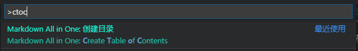

- [操作相关](#%e6%93%8d%e4%bd%9c%e7%9b%b8%e5%85%b3)
- [自动生成目录](#%e8%87%aa%e5%8a%a8%e7%94%9f%e6%88%90%e7%9b%ae%e5%bd%95)

# 操作相关

- 禅（全屏）模式：`Ctrl+KZ`（按两次`Esc`退出）

- 并排编辑：`Ctrl+\`            按`Ctrl+1`、`Ctrl+2`、`Ctrl+3`在编辑器之间切换；

- 先将鼠标放在向右分割按钮上，然后按住`Alt`键，按钮变为向下分割按钮：

- 多光标选择

  - 任意位置多光标：==Alt==（按住不放） + 鼠标任意位置单击；
  - 同一列多光标：Ctrl+Alt+↑或者Ctrl+Alt+↓；
  - 多个单词同时选中：先选中单词，然后按Ctrl+Shift+L；
  - 列（框选）：按住Shift+Alt并拖动鼠标；
  - 快速滚动：Alt+滚轮；
  - 某一行上下移动：Alt+↑或↓；
  - 收缩/扩展选择：Shift+Alt+←或→；
  - 修剪尾随空格：Ctrl+K Ctrl+X；
  - 重命名符号：先选中一个符号，然后按F2；
  - 智能感知：按Ctrl+Space可手动触发感知；

# 自动生成目录
- markdown all in one插件自带功能
- ctrl+shift+p
- ctoc
