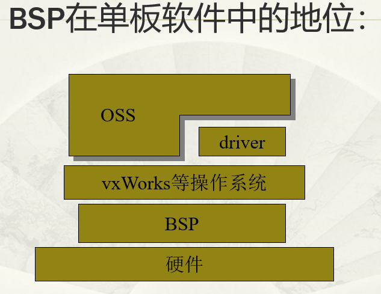
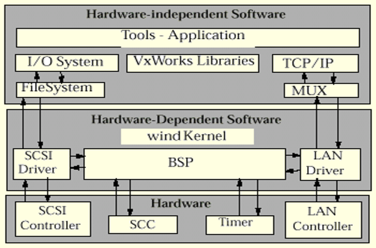

# 前言
近期在做固件分析的相关知识，由于不明白VxWorks系统不了解，所以想先从正向了解一下系统的基础知识再进行逆向分析。

# 简介
> VxWorks 是美国 Wind River System 公司（ 简称风河 公司 ，即 WRS 公司）推出的一个==实时操作系统==。

> VxWorks操作系统由以下5部分构成：板级支持包BSP、微内核wind、网络系统、文件系统以及I/O系统

> 实时多任务操作系统是能在确定的时间内执行其功能，并对外部的异步事件作出响应的计算机系统

# BSP
## 简介
> BSP(Borad Support Packet),板级支持包对单板的硬件功能提供了统一的==软件接口==，它包括硬件初始化、中断的产生和处理、硬件时钟和计时器管理、内存地址映射、内存分配等等。每个板级支持包括一个 ROM 启动（Boot ROM）或其它启动机制。
> 板级支持包（BSP）（Board Support Package）是介于主板硬件和操作系统中驱动层程序之间的一层，一般认为它属于操作系统一部分，主要是实现对操作系统的支持，==为上层的驱动程序提供访问硬件设备寄存器的函数包==，使之能够更好的运行于硬件主板。在嵌入式系统软件的组成中，就有BSP。BSP是相对于操作系统而言的，不同的操作系统对应于不同定义形式的BSP,例如VxWorks的BSP和Linux的BSP相对于某一CPU来说尽管实现的功能一样，可是写法和接口定义是完全不同的，所以写BSP一定要按照该系统BSP的定义形式来写（BSP的编程过程大多数是在某一个成型的BSP模板上进行修改）。这样才能与上层OS保持正确的接口，良好的支持上层OS。 ——百度百科

**也就是说，可以简单的理解为操作系统用来操作硬件的工具包**

oss：此处应该为开源软件的意思

## VxWorks中的BPS
> 最小系统BSP：包含了CPU系统的初始化程序以及网口，串口，系统时钟等设备的驱动程序。

> 针对某类CPU的硬件单板，VxWorks通常提供有其DEMO板的BSP,也就是我们所说的最小系统BSP。

> 一般来说，我们在硬件系统设计好之后，都会先找到一个与自己系统相近的DEMO板BSP,并以此为基础,开发自己单板的BSP。

> VxWorks为了最大限度的支持不同的硬件环境，也提供了一些常用硬件芯片的驱动程序，它们通常是与具体CPU无关的设备，如一些PCI网口芯片，串口芯片等。这些驱动程序大多实现为CPU无关或很容易移植，可以方便的用于其他CPU平台。这也是开发驱动程序所应该遵循的原理。另外，我们的最小系统BSP,往往在==默认情况下，使用这些驱动程序==。

**也就是说我们做的VxWorks开发就是BSP的开发？**

### BSP功能
- 给VxWorks提供硬件环境接口
- BSP 主要负责:硬件上电初始化；支持 VxWorks访问硬件驱动；把硬件相关和无关的软件很好地结合到VxWorks。
- BSP不是硬件驱动程序 :是一种访问硬件的硬件驱动程序；硬件驱动分为通用和BSP有关两类；通用驱动管理可在目标环境间移动的设备 (如以太网芯片)；BSP 驱动管理特定目标环境的设备 (如中断控制器）。
BSP与VxWorks的关系：

**BSP用来调硬件驱动的驱动**

## BootRom
> VxWorks借鉴了传统PC操作系统的引导原理，其将整个引导过程分为两个阶段：1、BOOTROM启动2、通过BOOTROM加载VxWorks映象

> BOOTROM相当于PC机中的BIOS，它完成对加载过程中所需设备的初始化及驱动；然后通过某种可选择的通讯手段（如网口，串口），将VxWorks内核映象到内存中，并执行。此处的VxWorks映象就相当于我们在PC机上装的操作系统，如DOS,Windows。

> BOOTROM和VxWorks使用不同方法来编译生成。
**BootRom用来初始化设备和驱动，然后加载VxWorks内核**

# Tornado
> Tornado 是WRS 公司推出的一套实时操作系统开发环境，提供了丰富的调试、仿真环境和工具。

