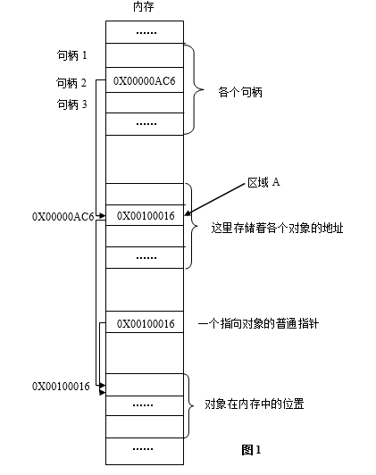
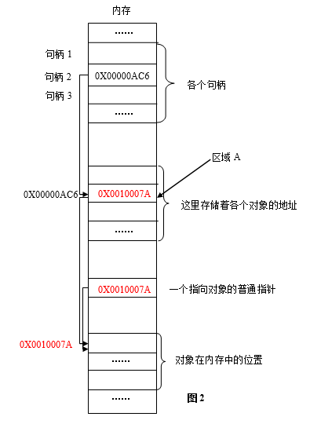

- [写在前面：](#%e5%86%99%e5%9c%a8%e5%89%8d%e9%9d%a2)
- [这里需要说明：](#%e8%bf%99%e9%87%8c%e9%9c%80%e8%a6%81%e8%af%b4%e6%98%8e)
- [让我们先看图，再解释。](#%e8%ae%a9%e6%88%91%e4%bb%ac%e5%85%88%e7%9c%8b%e5%9b%be%e5%86%8d%e8%a7%a3%e9%87%8a)
- [简单解释：](#%e7%ae%80%e5%8d%95%e8%a7%a3%e9%87%8a)
- [下面，关于句柄，再交代一些关键性细节：](#%e4%b8%8b%e9%9d%a2%e5%85%b3%e4%ba%8e%e5%8f%a5%e6%9f%84%e5%86%8d%e4%ba%a4%e4%bb%a3%e4%b8%80%e4%ba%9b%e5%85%b3%e9%94%ae%e6%80%a7%e7%bb%86%e8%8a%82)
- [写在后面：](#%e5%86%99%e5%9c%a8%e5%90%8e%e9%9d%a2)
- [转自](#%e8%bd%ac%e8%87%aa)

# 写在前面：

对于“句柄”，在下一直停留在一知半解的认识层面，近日在下学习Windows编程，决定趁此机会将句柄彻底搞清楚。查阅了一些网络上的资料，发现网络上的讲解大概可以分为两类：一种是以比喻、类比的方式说明，这种方法虽然形象易懂，但并没有从原理上、本质上加以揭示，让人仍然想问“为什么？”、“怎么实现？”。另一种是给出源代码，无可厚非，这当然是最本质的说明了，但这样一来，又显得不够直观，初学者理解起来有一定的难度。鉴于此，在下尽微末之能，结合自己的愚见，在两者之间折中，用图解的方式来将原理呈现出来，做到一目了然。

# 这里需要说明：

1.这里将句柄所能标识的所有东西（如窗口、文件、画笔等）统称为“对象”。

2.图中一个小横框表示一定大小的内存区域，并不代表一个字节，如标有0X00000AC6的横框表示4个字节。

3.图解的目的是为了直观易懂，所以不一定与源码完全对应，会有一定的简化。

# 让我们先看图，再解释。

其中，图1是程序运行到某时刻时的内存快照，图2是程序往后运行到另一时刻时的内存快照。红色部分标出了两次的变化。

# 简单解释：

Windows是一个以**虚拟内存**为基础的操作系统，很多时候，进程的代码和数据并不全部装入内存，进程的某一段装入内存后，还可能被换出到外存，当再次需要时，再装入内存。两次装入的地址绝大多数情况下是不一样的。

也就是说，**同一对象在内存中的地址会变化**。（对于虚拟内存不是很了解的读者，可以参考有关操作系统方面的书籍）那么，程序怎么才能准确地访问到对象呢？为了解决这个问题，Windows引入了句柄。

系统为每个进程在内存中分配一定的区域，用来存放各个句柄，即一个个32位无符号整型值（32位操作系统中）。每个32位无符号整型值相当于一个指针，指向内存中的另一个区域（我们不妨称之为区域A）。而区域A中存放的正是对象在内存中的地址。当对象在内存中的位置发生变化时，区域A的值被更新，变为当前时刻对象在内存中的地址，而在这个过程中，区域A的位置以及对应句柄的值是不发生变化的。

这种机制，用一种形象的说法可以表述为：有一个固定的地址（句柄），指向一个固定的位置（区域A），而区域A中的值可以动态地变化，它时刻记录着当前时刻对象在内存中的地址。这样，无论对象的位置在内存中如何变化，只要我们掌握了句柄的值，就可以找到区域A，进而找到该对象。而句柄的值在程序本次运行期间是绝对不变的，我们（即系统）当然可以掌握它。这就是以不变应万变，按图索骥，顺藤摸瓜。

所以，我们可以这样理解Windows句柄：

- 数值上，是一个32位无符号整型值（32位系统下）；
- 逻辑上，相当于指针的指针；
- 形象理解上，是Windows中各个对象的一个**唯一的、固定不变的ID**；
- 作用上，Windows使用句柄来标识诸如窗口、位图、画笔等对象，并通过句柄找到这些对象。

# 下面，关于句柄，再交代一些关键性细节：

1.所谓“唯一”、“不变”是指在程序的一次运行中。如果本次运行完，关闭程序，再次启动程序运行，那么这次运行中，同一对象的句柄的值和上次运行时比较，一般是不一样的。

&emsp;&emsp;其实这理解起来也很自然，所谓“一把归一把，这把是这把，那把是那把，两者不相干”（“把”是形象的说法，就像打牌一样，这里指程序的一次运行）。

2.句柄是对象生成时系统指定的，属性是只读的，程序员不能修改句柄。

3.不同的系统中，句柄的大小（字节数）是不同的，可以使用sizeof()来计算句柄的大小。

4.通过句柄，程序员只能调用系统提供的服务（即API调用），不能像使用指针那样，做其它的事。

# 写在后面：

1.到此为止，有关Windows句柄就简单介绍到这里。需要说明的是，本文是面向初学者的，旨在让读者对句柄有一个完整而清晰的认知，既要避免知其然而不知其所以然的茫然困惑，又要避免深入源码的艰难晦涩。因此，本文并不能做到绝对的直达本质，同时也可能在个别细节上与真实情况稍有出入，但在下认为这并不贻害初学者对句柄的认识。因为对某一知识的认知，从几乎一无所知或是一知半解到“精通”，往往需要更多新知识的补充，短时间内很难达到，在不影响知识的使用的前提下，先把握整体，在逐步深入细节，不失为一个明智的选择。想进一步深入理解Windows句柄的读者，可以看在下的下一篇文章[《源码剖析——深入Windows句柄本质》](https://www.cnblogs.com/zpcdbky/p/4656449.html)。

2.在下知识有限，理解不深，如有错误纰漏之处，这里再三恳请大家一定要为在下指出。大家的批评指正是在下进步的源泉。

# 转自
https://www.cnblogs.com/zpcdbky/p/4652151.html

原文的参考：

http://blog.csdn.net/newjerryj/article/details/4383701

http://www.cnblogs.com/yellowyu/archive/2009/06/07/1497910.html

