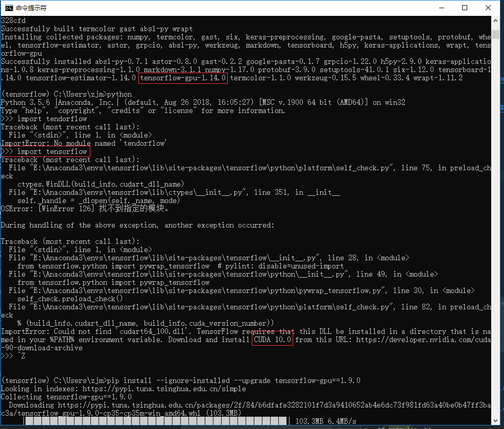
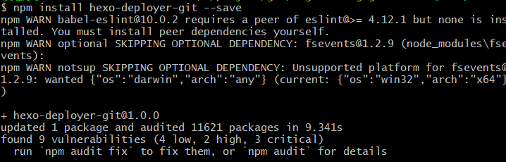
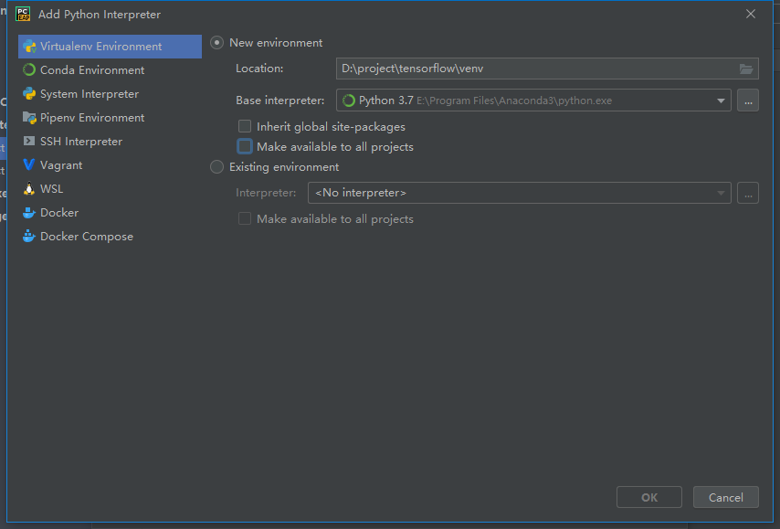
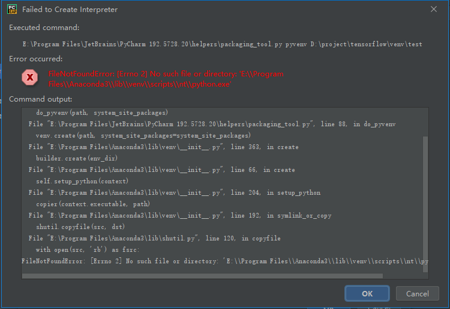

- [声明](#%e5%a3%b0%e6%98%8e)
- [CentOS](#centos)
  - [界面相关](#%e7%95%8c%e9%9d%a2%e7%9b%b8%e5%85%b3)
- [搭建win10 tensorflow-gpu环境时注意顺序](#%e6%90%ad%e5%bb%bawin10-tensorflow-gpu%e7%8e%af%e5%a2%83%e6%97%b6%e6%b3%a8%e6%84%8f%e9%a1%ba%e5%ba%8f)
- [npm安装提醒audit](#npm%e5%ae%89%e8%a3%85%e6%8f%90%e9%86%92audit)
- [pycharm创建虚拟环境出错](#pycharm%e5%88%9b%e5%bb%ba%e8%99%9a%e6%8b%9f%e7%8e%af%e5%a2%83%e5%87%ba%e9%94%99)
- [Anaconda安装的时候千万不要关闭弹出来的命令行](#anaconda%e5%ae%89%e8%a3%85%e7%9a%84%e6%97%b6%e5%80%99%e5%8d%83%e4%b8%87%e4%b8%8d%e8%a6%81%e5%85%b3%e9%97%ad%e5%bc%b9%e5%87%ba%e6%9d%a5%e7%9a%84%e5%91%bd%e4%bb%a4%e8%a1%8c)

# 声明
本文没什么技术含量，仅仅作为个人遇到坑之后的记录与反思

# CentOS
## 界面相关
Linux默认的情况下会提供六个Terminal来让使用者登陆， 切换的方式为使用：[Ctrl] + [Alt] + [F1]~[F6]的组合按钮，系统会将[F1] ~ [F6]命名为**tty1 ~ tty6**的操作接口环境。tty2~tty6一开始是不存在的！按下 [ctrl]+[alt]+[F2]，系统才产生出额外的 tty2, tty3。

启动窗口界面：`startx`

# 搭建win10 tensorflow-gpu环境时注意顺序
大部分教程都是教你：
- 1、先下python某版本（eg.3.5）`conda create -n tensorflow-gpu python=3.5`
- 2、再下某版本cuda以及对应版本cudnn
- 3、再下tensorflow-gpu`pip install --ignore-installed --upgrade tensorflow-gpu==1.9.0`

由于教程都是会越来越旧，所以安装的tensorflow可能需要的gpu版本不对

所以最好是132的顺序

*别费事,cuda9.0对应tensorflow1.9;cuda10.0对应tensorflow1.14*

查看虚拟环境`conda info --envs`
# npm安装提醒audit

此处版本不合理问题，如果按照提示执行`npm audit`相关指令还是没效果，可以不用理会，不影响正常使用

*注意仔细看字，别因为是英文就一目十行，当时遇到这个问题其实不是问题，结果没出现只是因为别的地方开关没开，要专心*
# pycharm创建虚拟环境出错

用anaconda3创建虚拟环境出错，改用2，或者手动下载python3的纯净包

*似乎是anaconda3包的问题，重装电脑之后尽量不要两个anaconda版本一起使用*
# Anaconda安装的时候千万不要关闭弹出来的命令行
弹出来的命令行是在安装相关的组件，不然conda什么的都会没有。。。

*做动作之前要考虑一下，别随便乱点*